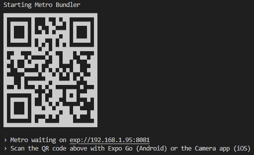

# Logbook alternative for sailors and boaters

### Requirements:
#### Backend:
Access to a bash-like terminal environment:
Windows users:
[Windows Subsystem for Linux](https://learn.microsoft.com/en-us/windows/wsl/install)
[Git for Windows](https://gitforwindows.org/)

[Docker](https://docs.docker.com/get-started/get-docker/) is required for running the development environment.

#### Mobile app:
Install node.js on your computer:
[Node 22.x LTS](https://nodejs.org/en/download)

##### Expo Go (Recommended, Easy)
[Google Play](https://play.google.com/store/apps/details?id=host.exp.exponent)
[App Store](https://apps.apple.com/us/app/expo-go/id982107779)

##### Emulators
[Android emulator](https://docs.expo.dev/workflow/android-studio-emulator/)
[iOS simulator](https://docs.expo.dev/workflow/ios-simulator/)

#### Setting up backend development environment

##### 1. Clone this repository

```
git clone https://github.com/sologit-solutions/mobile-log-book.git
```

##### 2. Make local copies of .env files

To prevent unwanted commits overriding defaults copy the .env files with your name or whatever as a prefix.
Note that this step will require manually modifying the line "export ENV_FILE=dev.env" in example.load.env 
to match the new name. 

```
cp dev.env example.dev.env
```

```
cp load.env example.load.env
```

##### 3. Load environment variables and helper commands

Load environment variables and helper commands into your current shell environment.

```
source example.load.env
```

##### 4. Run setup script to install dependencies

This step installs project dependencies to prevent your IDE/Text editor from complaining.
It is not required to run the project with docker as the containers perform a clean install.

```
run-setup
```

##### 5. Create the development database

This command runs prisma migrations on the dev container to create the local
database. It iss also used to create new migrations after editing the prisma
schemas.

```
migrate-dev
```

##### 6. Build and run the development environment

This command builds and runs the containers using the development configuration.

```
run-dev
```

The development environment has hot-reloading enabled to make development easier
without having to restart the container.

##### Other commands:

Stop and remove development containers

```
dev-down
```

Chain with -v flag to destroy everything including the database 

```
dev-down -v
```

Run production configuration

```
run-prod
```

#### Setting up mobile app

##### Navigate to the `/mobile` directory in terminal

##### Install dependencies

```
npm install
```

##### (Optional) Configure .env to use the live api
in  the `/mobile` directory create a .env file with the following contents 

```
EXPO_PUBLIC_API_URL=https://api.sologit.com
```

##### Start expo

```
npx expo start
```

##### Using Expo Go mobile app
N.B. For this to work your phone and computer need to be on the same network.
Scan the QR code in the terminal to use bundle the app to your phone.



##### Using Android Emulator
[Android emulator](https://docs.expo.dev/workflow/android-studio-emulator/)

1. Download and install the emulator.

2. When Android Studio is launched on the "Welcome to android studio" screen select More Actions.

3. Select Virtual Device Manager

4. Select the "+" sign in the Device Manager to create a new device.

5. Start the device emulator.

6. Choose `› Press a │ open Android` option in terminal with expo running to launch the app in the emulator.